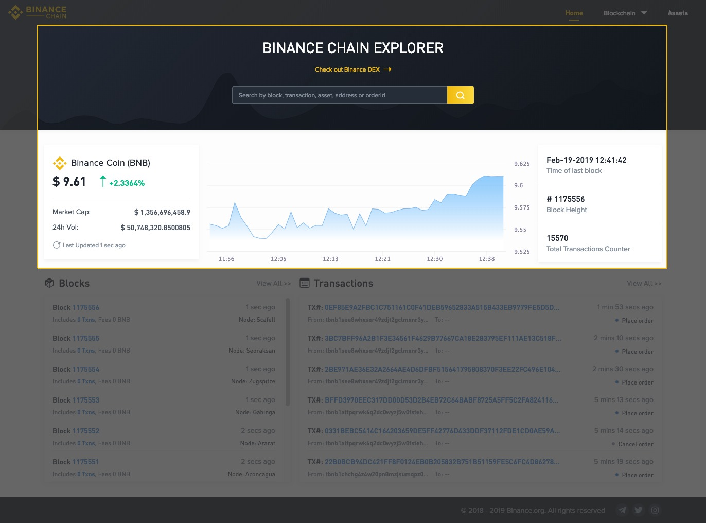
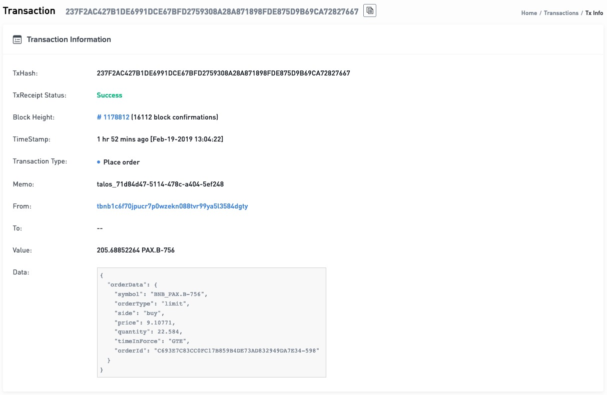
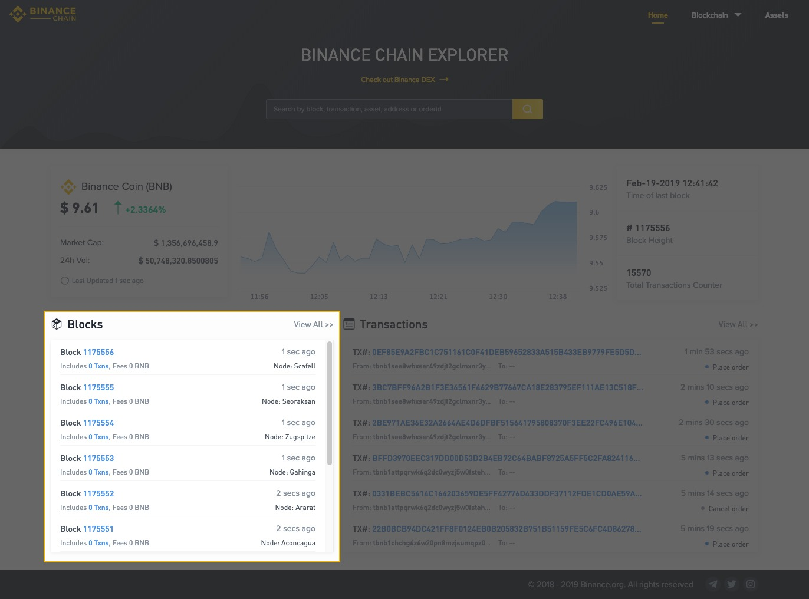
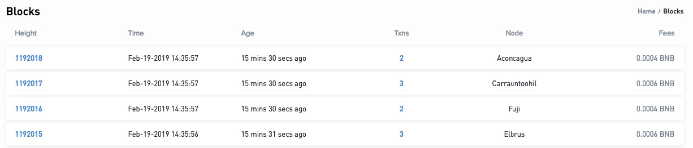

Navigate to the Binance Chain Explorer (Testnet)

**What is the Binance Chain Explorer?**
The explorer is a graphic user interface designed to allow users to interact with the blockchain. Through this interface, a user can browse information about blocks that have been added to the blockchain, transactions that have occurred on the blockchain, wallet balances and information about Binance Coin (BNB).

**Overview**
If you wish to search for a specific block, transaction, order, asset or address you can do so through the search bar in the banner of the Binance Chain Explorer.

You can also review the latest price, market cap, and 24h volume for Binance Coin.

**Transactions**
From the front page of the Binance Chain Explorer, you can see a summary of the 6 most recent transactions on the Binance Chain. If you wish to view more, you can click on “View All >>”.

When viewing all the transactions, you will be able to find the TxHash (Transaction Hash, or Transaction ID), the block height, the age of the transaction, what type of transaction it was (place order, cancel order or transfer), which address initiated the transaction and, the address which received the asset if the transaction type was a ‘transfer’.

To view more detail about a specific transaction, clicking on a TxHash will take you to a more in-depth overview of the parameters of that specific transaction.

**Blocks**
From the front page of the Binance Chain Explorer, you can see a summary of the 10 most recent blocks produced on the Binance Chain. If you wish to view more, you can click on “View All >>”

When viewing all the blocks on the blockchain, you will be able to find information on the block height, the time the block was produced, the age of the block, the number of transactions in the block, the node that produced the block and, the fees associated with that block.

To view more detail about a specific block, clicking on a block height will take you to a more in-depth overview of the parameters of that specific block.

**Assets**
You can also view all assets issued on Binance Chain by heading to the asset explorer (testnet). Here you can find information such as the name of the asset, the market capitalization, the current price, total supply, and the creator’s address.